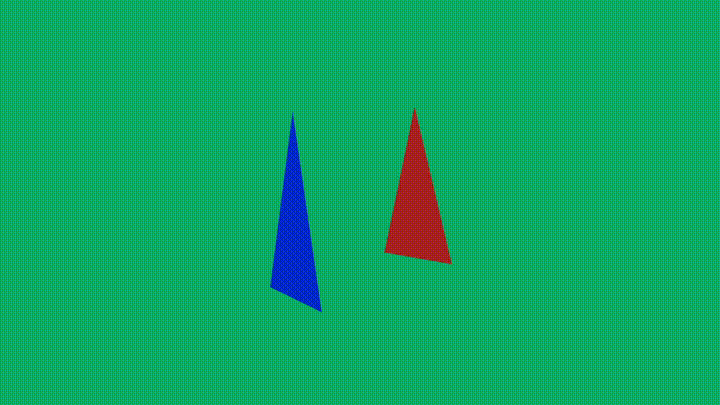

# Задание 3

<pre>
    Добавить камеру в <a href="../task2">сцену</a>, поиграться с функцией LookAt. 
    
    Важно! После этого создать простой аналог анимационного фильма, где камера кружится вокруг тех двух треугольников,
    захардкодить её движение (не использовать ввод с мыши и клавиатуры).
</pre>

