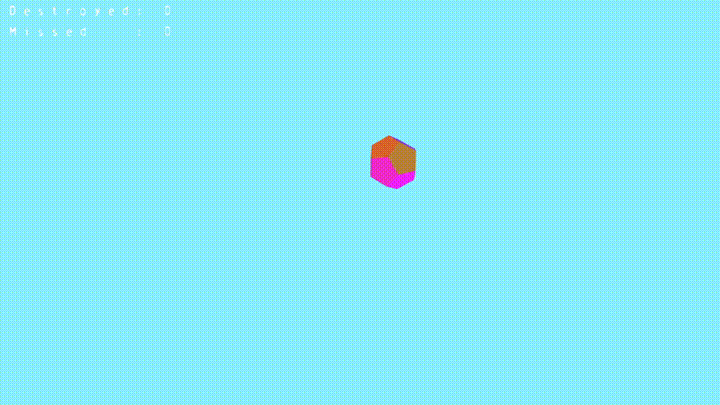

# Домашнее задание №2: Создаем шутер на OpenGL

<pre>
    1. В нашей сцене учимся создавать объекты (те самые пирамиды/бублики/шары из 1го задания) с необходимыми позицией и
        ориентацией. Пример: Instantiate(Vector3 position, Vector3 rotation)
    2. Создаем эти объекты в сцене в рандомных точках окрестности камеры (по типу не ближе 2х попугаев, но не дальше 50ти 
        попугаев) с опреденными временными интервалами (лучше по времени (раз в несколько секунд),  но можно и по количеству
        прошедших кадров ( раз в n кадров) ) и рандомной ориентацией в пространстве
       
        Поздравляю, вы создали себе врагов
       
        Теперь создаем снаряды
       
    3. Создаем "fireball" (не принципиально, будет ли это заранее сгенерированный 3D объект, как описывается в 7ом уроке 
        туториала, либо сгенерированные по сфере точки, превращенные в полигоны)
    4. "Натягиваем" на шар текстуру (любую вам приятную)
    5. Добавляем шару возможность двигаться в направлении камеры. 
        (как пример: position += camera.forward × moveSpeed × deltaTime)
       
        Порадуйтесь, что создали странноуправляемый наводящийся заряд.
    6. Исправьте, чтобы каждый шар двигался в своем постоянном направлении
    7. Каждому объекту добавляем "коллайдер". Определенное расстояние в попугаях (радиус сферы),которое мы используем для
        просчета соприкосновения объектов. Т.е. для всех наших снарядов попарно проверяем, что расстояния между центрами
        объектов меньше суммы радиусов коллайдеров 
       
        Пример: 
            if (Math.abs(object.position - fireball.position) < object.colliderRadius + fireball.colliderRadius)  
                object.delete();
    8. При взаимодействии объектов, удаляем оба объекта
    
    ---
    
    На доп. Балл:
    - Убираем весь свет в сцене, делаем источником света fireball-ы
    - показываем на экране кол-во сбитых объектов
    
    Супердопбалл: добавляем возможность сохранить и загрузить состояние нашей сцены (при нажатии определенной кнопки, 
        сохраняем все необходимые данные объектов в текстовый файл, при нажатии другой, из него загружаем эти данные    
</pre>

